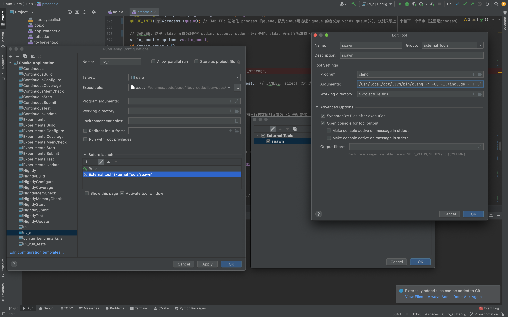
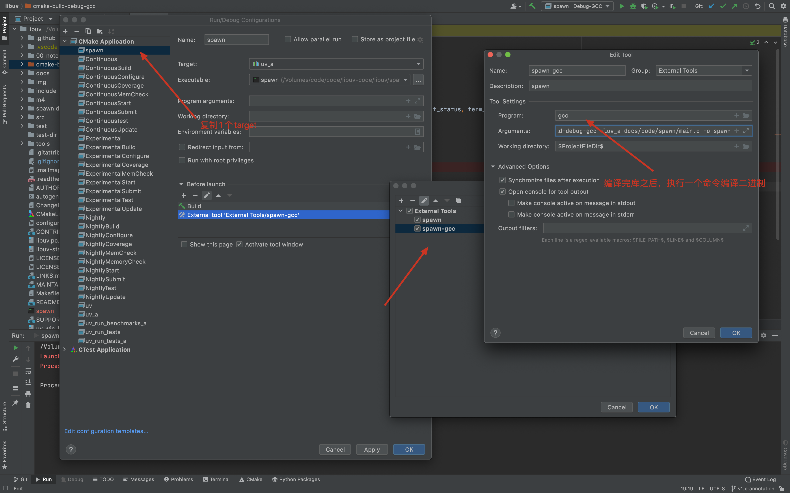
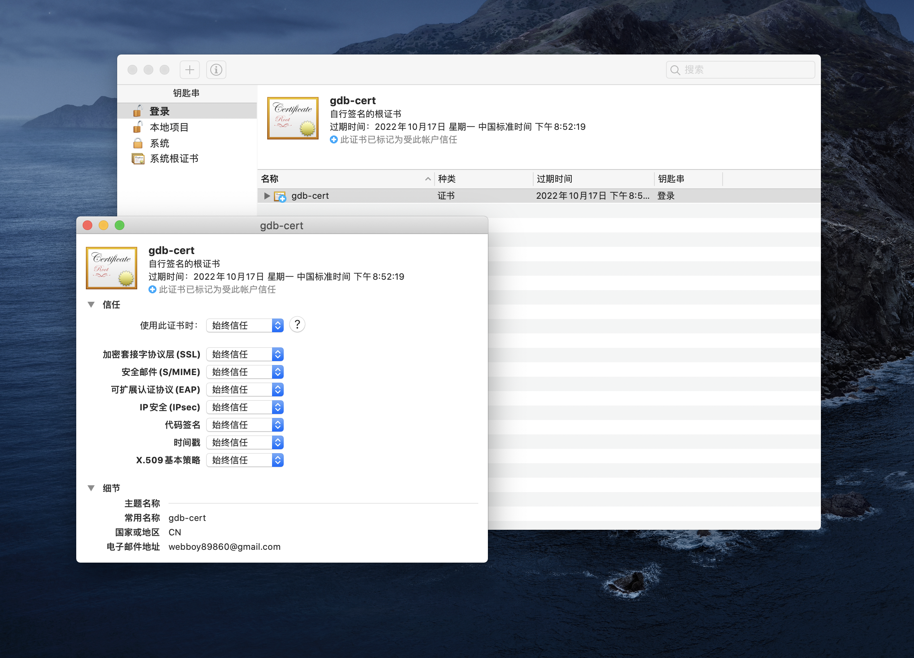
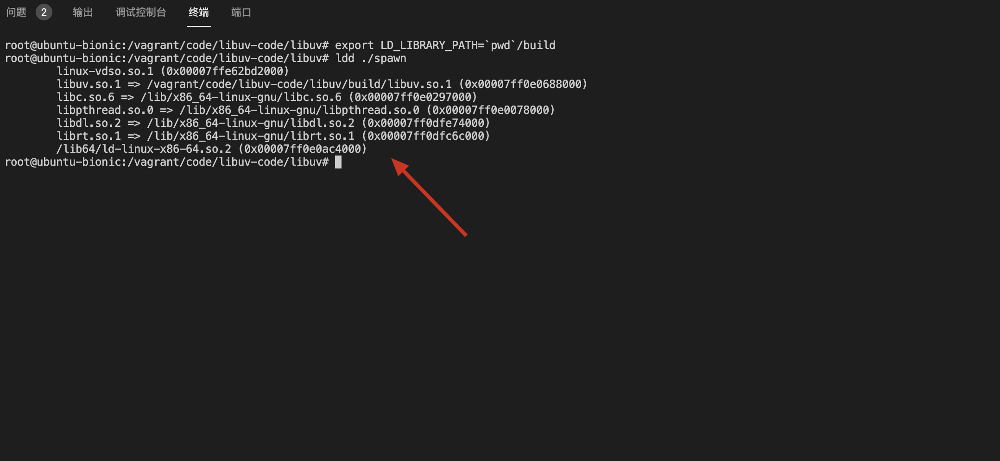
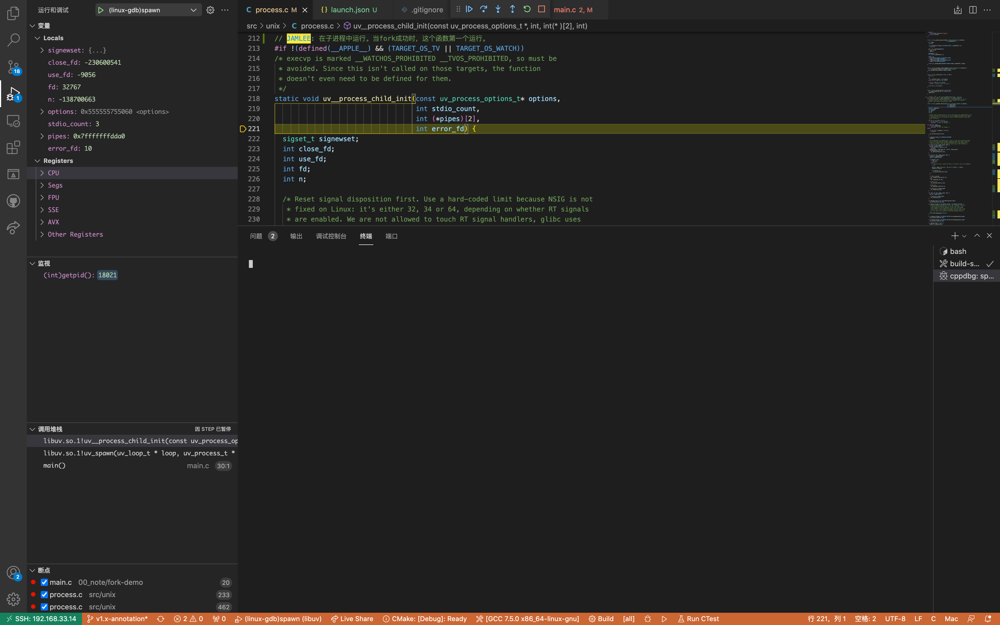
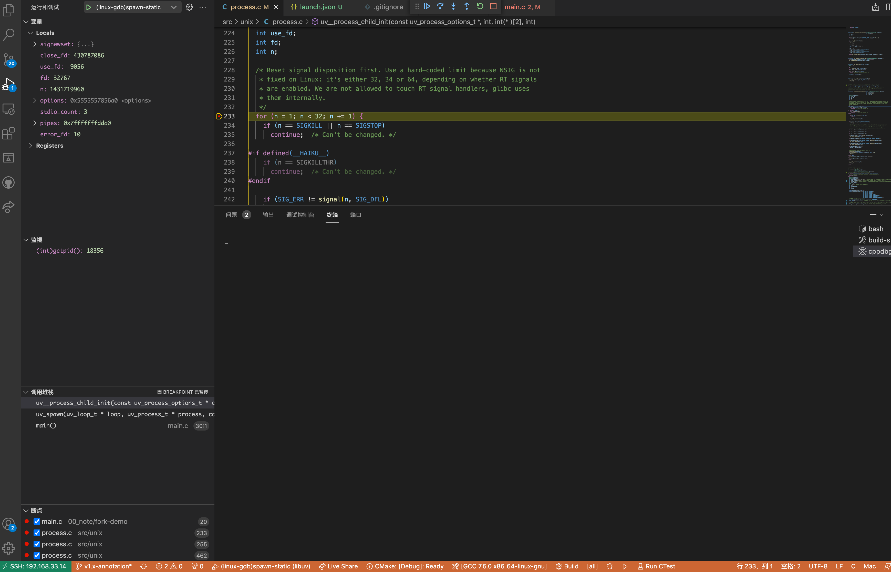
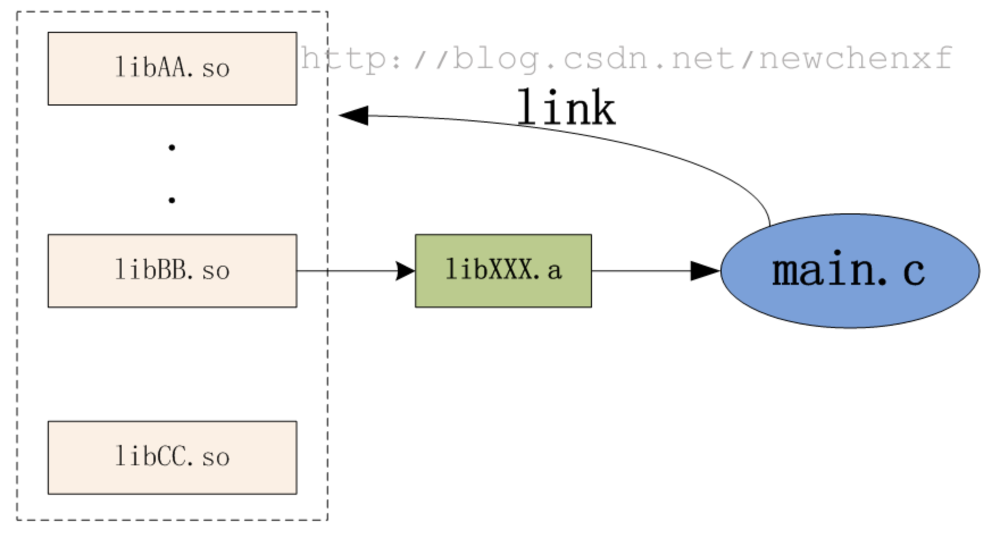

印象 [libuv: 源码分析](https://app.yinxiang.com/fx/6f54ecb0-f1b1-43b8-ae80-c39fa61d0726) ，语雀 [libuv: 源码分析](https://www.yuque.com/xiaoluobutuziaiqingcai/gtw3h9/um937h)

[TOC]

分析代码时，最关心这个库如何用各种形式运行起来，调试起来。这个 readme.md 放到这比较显眼。

## 运行&调试方法
### 用 clion 和 vscode 运行
clion: 可以加载 cmake 和 makefile。 clang 没办法执行子进程断点。gdb 有版本限制，20211017 时只支持 gdb 8到10的版本，但是此时最新的brew里是gcc11。

vscode: 注意 c++ 的 IntelliSense 的来源, 可以由 cmake 获取。


### 运行注意事项
1. 新建 gcc 的工具链。gcc 在mac上默认指向了clang。gdb默认没有签名。这些需要处理。
2. cmake 的工具链改为 gcc。clang默认不能调试子进程，子进程的断点命中不了。 
3. mac 上的 gdb，时不时会 hang 住，基本无法使用。**最终还是 vscode remote 比较方便**。
4. vscode 和 clion 有设置库路径和头文件路径配置的地方。https://code.visualstudio.com/docs/cpp/config-clang-mac。
````
mkdir build
cmake .. -DBUILD_TESTING=OFF  -DCMAKE_BUILD_TYPE=Debug -DCMAKE_C_COMPILER=/usr/bin/gcc
cmake --build build
````

````bash
# clang 编译
clang -g -O0 -I../../../include -L../../../cmake-build-debug -luv_a main.c

# 改工作目录
clang -g -O0 -I./include -L./cmake-build-debug -luv_a  docs/code/spawn/main.c
````


````bash
# gcc 编译, mac 默认 gcc 指向了 clang
gcc-11 -g -O0 -I../../../include -L../../../cmake-build-debug -luv_a main.c

# 改工作目录和开发工具安全性关闭
gcc-11 -g -O0 -I./include -L./cmake-build-debug-gcc -luv_a  docs/code/spawn/main.c -o spawn
````


解决mac上gdb权限问题, 首先创建证书，然后用证书给gdb签名。证书需要手动确认信任。



有的还有脚本完成上面的事情
https://github.com/llvm-mirror/lldb/blob/master/scripts/macos-setup-codesign.sh

gdb 不能运行时的操作
````bash
# 看 gdb-darwin 目录的 gdb.xml
codesign --entitlements gdb.xml -fs gdb-cert /usr/local/bin/gdb
sudo DevToolsSecurity -disable
gdb ./spawn
````

在mac上用gdb时不时会hang住，最终还是用 vscode 的 remote 来做比较好了。放弃掉mac下的gdb。不涉及多进程的可以用 lldb。不过我还是尽量保持开发和测试用 gdb ，更方便。

````bash
sudo -i # 进入 root
echo 'set follow-fork-mode child' >> ~/.gdbinit
````

### Vscode 远程调试
1. lanucher.json 的公共属性。
https://code.visualstudio.com/docs/editor/debugging#_launchjson-attributes

````bash
# 动态链接
gcc  docs/code/spawn/main.c -o spawn --verbose  -g -O0 -I./include/ -L./build/ -luv

# 静态链接， -B 会影响后续所有的参数的行为。静态库里面的动态库需要指定出来
gcc  docs/code/spawn/main.c -o spawn --verbose  -g -O0 -I./include/ -L./build/ -Wl,-Bstatic -luv_a  -Wl,-Bdynamic -ldl -lpthread

gcc docs/code/spawn/main.c -o spawn --verbose  -g -O0 -I./include/ -L./build/ -l:libuv_a.a -ldl -lpthread

https://stackoverflow.com/questions/6578484/telling-gcc-directly-to-link-a-library-statically
在Linux下，如何强制让GCC静态链接？ - 知乎
https://www.zhihu.com/question/22940048
````

运行时注意动态库的路径， 设置成自己的目录。不然走到系统的 libuv 上去了


动态库断点调试, 调试子进程，实测通过。断点后同时两个进程。



静态库链接也调试成功



## 整理资料
### vscode mac clang 配置
https://code.visualstudio.com/docs/cpp/config-clang-mac，https://code.visualstudio.com/docs/cpp/customize-default-settings-cpp
````json
{
  "configurations": [
    {
      "name": "Mac",
      "includePath": ["${workspaceFolder}/**"],
      "defines": [],
      "macFrameworkPath": [
        "/Library/Developer/CommandLineTools/SDKs/MacOSX.sdk/System/Library/Frameworks"
      ],
      "compilerPath": "/usr/bin/clang",
      "cStandard": "c11",
      "cppStandard": "c++17",
      "intelliSenseMode": "clang-x64"
    }
  ],
  "version": 4
}
````

### follow-fork-mode
用法：set follow-fork-mode [parent|child]
进入gdb后，直接设置，默认是parent
所以如果想要调试子进程，进入gdb后设置set follow-fork-mode child，然后设置子进程的断点
可用使用show follow-fork-mode 来查询当前fork模式
使用follow-fork-mode，只能调试一个进程，不能同时调试父子进程

### detach-on-fork mode
用法：set detach-on-fork [on|off]
on: 只调试父进程或子进程的其中一个(根据follow-fork-mode来决定)，这是默认的模式。
off: 父子进程都在gdb的控制之下，其中一个进程正常调试(根据follow-fork-mode来决定),另一个进程会被设置为暂停状态。
如果设置了set detach-on-fork off且follow-fork-mode为parent，fork后子进程并不运行，而是处于暂停状态。

### linux 看动态库导出函数列表
有两种方式：
1.使用objdump命令。
例如：objdump -tT xxx.so

2.使用nm命令（个人觉得使用nm方式查看更方便。）
例如 nm -D xxx.so
nm -g --defined-only build/libuv.so 
（-D或-dynamic选项表示：显示动态符号。该选项仅对于动态库有意义）得到的结果中以T开头的就是导出函数

### linux 看静态库导出函数列表
nm -g --defined-only libxxx.a
nm -g --defined-only build/libuv_a.a 

## 如果静态库也包含动态库
https://blog.csdn.net/newchenxf/article/details/51735600


## 参考资料
【1】https://stackoverflow.com/questions/18423124/please-check-gdb-is-codesigned-see-taskgated8-how-to-get-gdb-installed-w
【2】mac终端中，输入gcc命令，为什么运行的是clang？ - 知乎 https://www.zhihu.com/question/24275474
【3】http://abcdxyzk.github.io/blog/2019/12/12/debug-gdb-fork/